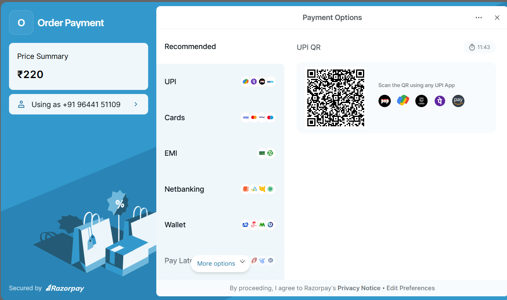
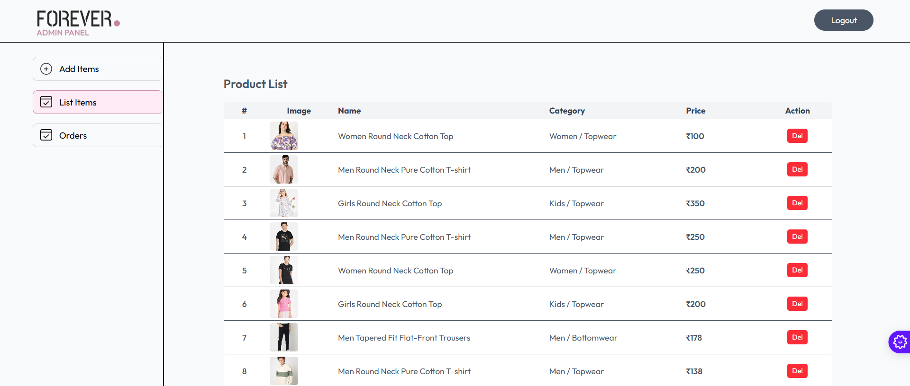

# Forever – E-Commerce App
### A complete solution for your online store

## Get Started 🚀

> []()
> []()
> []()

## Screens
> 
> 
> 
> 
> 

## Features
- **User Authentication** – Secure login and signup using JWT and bcrypt.
- **Product Management** – Add, update, delete, and fetch product details.
- **Image Uploads** – Integrated with Cloudinary and Multer.
- **Payment Gateways** – Razorpay and Stripe support.
- **Validation & Security** – Input validation using `express-validator`, environment variable handling via `dotenv`.
- **Database** – MongoDB with Mongoose ODM.

## Tech Stack
- **Backend Framework**: [Express.js](https://expressjs.com/)
- **Database**: [MongoDB](https://www.mongodb.com/) with [Mongoose](https://mongoosejs.com/)
- **Authentication**: [JWT](https://jwt.io/) + [bcrypt](https://www.npmjs.com/package/bcrypt)
- **Payments**: [Razorpay](https://razorpay.com/) & [Stripe](https://stripe.com/)
- **File Uploads**: [Multer](https://www.npmjs.com/package/multer) + [Cloudinary](https://cloudinary.com/)
- **Validation**: [express-validator](https://express-validator.github.io/)
- **Development Tool**: [Nodemon](https://nodemon.io/)

### Prerequisites
- Node.js >= 18
- MongoDB installed or Atlas cluster
- Cloudinary, Razorpay, and Stripe accounts

### Installation
```bash
git clone https://github.com/satyammalviya15/forever-ecommerce.git
cd forever-ecommerce
npm install
